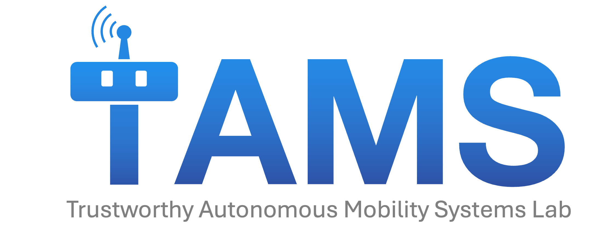

  

The **Trustworthy Autonomous Mobility System (TAMS) Lab** at UCLA develops the path from advances in AI to real-world autonomy in open-world, human-centered environments. We develop methods at the intersection of AI, robotics, and control, with applications in autonomous driving, social robot navigation, and manipulation. This GitHub organization is used to share research code, datasets, and software
toolkits developed through TAMS Lab research. For more details about our research and a complete publication list, please
refer to the **[TAMS Lab website](https://chentangmark.github.io/lab/)**.
